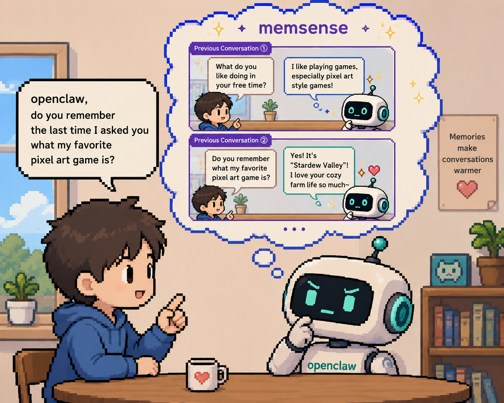
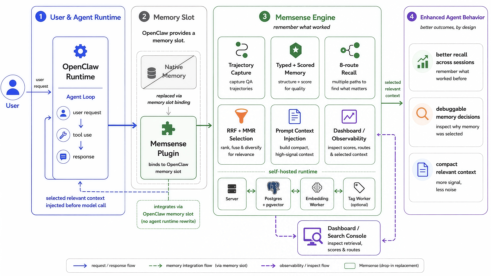
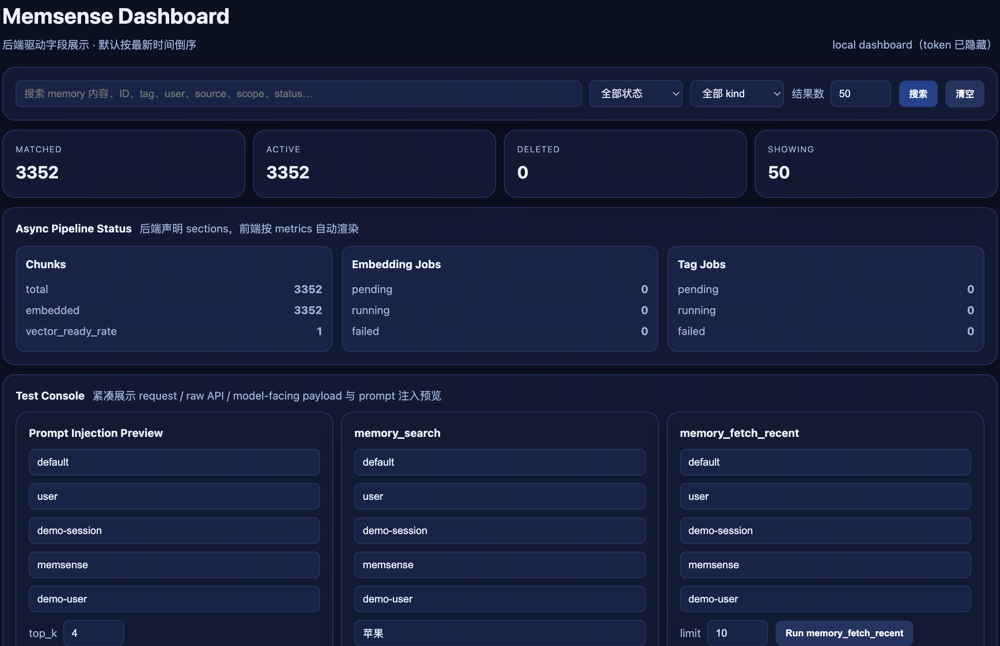
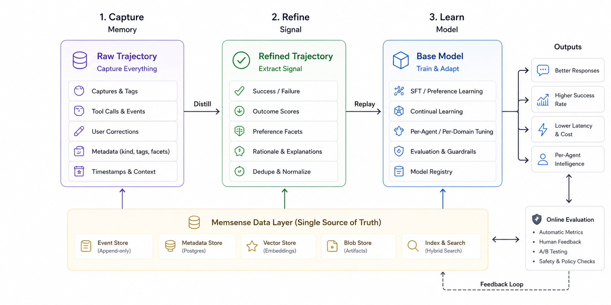

<div align="center">
# SenseNova 6.7 Flash-Lite
<h1 style="font-size: 16rem;">MemSense</h1>

<p>
  <a href="README.md"><strong>English</strong></a> ·
  <a href="README.zh-CN.md">中文</a>
</p>

</div>

<p align="center">
  
  
  
  
</p>

> A truly usable long-term memory for OpenClaw.

MemSense is an open-source memory plugin built for OpenClaw, turning long-term memory from something unstable and hard to inspect into a reliable, manageable foundation.
It preserves QA turns and manages memory with clear rules, reducing information loss, conflicts, and memory that gets messier over time.
Ready to run with Docker or no-Docker mode in a few commands. [**Quick Start**](#quick-start)

<p align="center">
  
</p>

---

## Overview

If you have used OpenClaw memory, you have probably run into problems like these:

- ❌ Memory keeps growing, but becomes harder to trust.
- ❌ Switching models can make memory behavior unstable.
- ❌ Important conversations may never get stored.
- ❌ When a memory is used, it is hard to inspect why.

MemSense has a simple goal: make OpenClaw memory **reliable, controllable, and usable over the long term**.

### ✨ Why MemSense

- **Plug-and-play, low integration cost.** No API key or external service is required in local mode. Connect it to OpenClaw, run it locally, and get started in minutes.
- **Fully open source and transparent.** Memory generation, storage, retrieval, and management logic are all visible, with no hidden strategy, making debugging, customization, and extension straightforward.
- **Stable and reliable.** User QA turns are recorded through the memory pipeline, reducing the uncertainty of memory that only sometimes gets saved.
- **Model-free.** MemSense does not depend on a model's built-in memory ability or prompt strategy, so switching models, tokenizers, or inference setups does not require memory-layer adaptation.

### Core Capabilities

- **Memory without summary compression.** MemSense does not replace QA with summaries; it preserves the original user/assistant meaning for later retrieval.
- **Memory Dashboard.** View, manage, and debug memory visually. You can see what was stored and why it was recalled.
- **Automated long-term memory management.** Rule-based organization, deduplication, scoring, archive, and soft-delete help keep memory structured over long-running use.
- **Consistent storage guarantees.** Memory is written as controlled, structured data, not left as a probabilistic side effect of model output or intermediate state.

### How MemSense Fits OpenClaw

<p align="center">
  
</p>

---

## Quick Start

### 1. Choose an embedding mode

| Mode | Best for | Requires |
|---|---|---|
| `local` | self-hosted, no external embedding API | Docker recommended; BGE model downloads on first run (~1 GB) |
| `openai` | fastest startup | `MEMSENSE_OPENAI_API_KEY` in `.env` |

### 2. Start MemSense

```bash
cp .env.example .env
bash scripts/bootstrap.sh local    # local embedding; first run downloads the BGE model unless cached
# or:
bash scripts/bootstrap.sh openai   # cloud embedding (set MEMSENSE_OPENAI_API_KEY in .env first)
```

Check services: `docker compose ps`

> **First run** downloads the BGE model and builds service images (~a few minutes). Subsequent startups are fast.

<details>
<summary>No Docker? (macOS / Linux alternative)</summary>

```bash
cp .env.example .env
bash scripts/bootstrap-nodocker.sh local   # or: ...nodocker.sh openai
bash scripts/start-bash.sh
```

On macOS, Homebrew installs PostgreSQL + pgvector automatically. On Linux, install Node.js 20+, PostgreSQL 16+, pgvector, Python 3, and venv support first.

`bootstrap-nodocker.sh` installs deps + initializes the database; `start-bash.sh` starts server, embedding worker, tag worker, and the Python BGE service.

</details>

<details>
<summary>Port conflict? (custom host port)</summary>

```bash
MEMSENSE_HOST_PORT=18787 bash scripts/bootstrap.sh local
```

`bootstrap.sh` also writes `MEMSENSE_API_URL=http://127.0.0.1:<host-port>` into `.env`, so the OpenClaw plugin calls the same port. Update all subsequent URLs accordingly (e.g. `http://127.0.0.1:18787/dashboard`).

</details>

### 3. Install into OpenClaw

```bash
openclaw plugins install -l <path-to-MemSense>
openclaw plugins enable MemSense
openclaw gateway restart
```

> `-l` does a linked install from a local path, useful while iterating on the plugin.
> If the gateway service is not installed yet, start/configure it first (`openclaw gateway install` or `openclaw gateway --allow-unconfigured` for a local smoke run). If an older `MemSense` install already exists, uninstall it or use a clean profile before installing this branch.

### 4. Bind the memory slot

```json
{
  "plugins": {
    "entries": { "MemSense": { "enabled": true } },
    "slots":   { "memory": "MemSense" }
  }
}
```

### 5. Open the dashboard

```
http://127.0.0.1:8787/dashboard?token=demo
```

> `demo` is the default development token. Change `MEMSENSE_DASHBOARD_TOKENS_JSON` before exposing the service beyond localhost.

### 6. Smoke test

```bash
MEMSENSE_SMOKE_BASE_URL=http://127.0.0.1:8787 \
MEMSENSE_SMOKE_TOKEN=demo \
npm run smoke:api
```

> A successful run prints the health / setup / pipeline / memory checks and ends with `[smoke] all api smoke checks passed`.

---

## Prerequisites

| Requirement | Version | Notes |
|---|---|---|
| **Node.js** | ≥ 20 | Needed for the no-Docker path and local development |
| **PostgreSQL** | ≥ 16, with `pgvector` | Needed for the no-Docker path |
| **Python** | ≥ 3.11 | Only needed for local BGE without Docker, and for `evaluation/` |
| **OS** | macOS / Linux | Windows works via Docker Desktop / WSL2 |
| **Disk** | ~1 GB free | One-time download of `BAAI/bge-large-zh-v1.5` on first local run |
| **OpenClaw** | ≥ 2026.3.1 | Declared as `peerDependencies` in [`package.json`](package.json) |

Docker is optional. The Docker quick start is the fastest path because it brings up Postgres, server, workers, and BGE together; the no-Docker path is documented above for local installs.

> **Choosing an embedding mode:** if you have a Qwen / OpenAI-compatible API key handy, `openai` mode skips the BGE download and starts in seconds. If you're running in an air-gapped or compliance-sensitive environment, pick `local`; pre-cache the Docker image and `BAAI/bge-large-zh-v1.5` model first, then MemSense can run without external embedding traffic.

---

## Core Concepts

Five ideas that distinguish MemSense from "vector store + RAG" memory plugins. Each one corresponds to a concrete code path you can read, not just a marketing claim.

### 1. Capture by hook, not by API call

Most memory plugins ask the agent to call `memory.save(...)` at the right moment. That's brittle — the agent forgets, mis-attributes, or saves noise. MemSense instead listens to OpenClaw's lifecycle:

- `llm_input` → normalize the user prompt, run a trigger heuristic, stash it.
- `llm_output` → take the matching assistant turn, build a canonical QA JSON, POST `/v1/memory/save`.

Inside a 10-minute window, identical user prompts are deduped at the chunk layer, so retries don't pollute the store. **You write zero capture code.**

📁 [`index.ts`](index.ts) (event handlers) · [`src/capture/`](src/capture) (`message-normalize.js`, `canonical-qa.js`, `chunk-builder.js`)

### 2. Eight-route retrieval, no LLM in the loop

A single vector route over "the whole turn" is too coarse — it confuses the user's question with the assistant's answer, and misses lexical hits like ticket IDs. MemSense fans out into **8 parallel routes**, then fuses them deterministically:

| # | Route | What it scores against |
|---|---|---|
| 1 | `vec_full` | full QA embedding (also used as MMR-dedup baseline) |
| 2 | `vec_user` | user-perspective embedding |
| 3 | `vec_asst` | assistant-perspective embedding |
| 4 | `vec_next_user` | the *follow-up* question — backfilled when chunk N+1 arrives |
| 5 | `lexical` | Postgres full-text search over `task_tag` + `content` |
| 6 | `facet_personal_info` | extracted personal-info facet |
| 7 | `facet_preferences` | extracted preferences facet |
| 8 | `facet_events` | extracted events facet |

Fusion uses Reciprocal Rank Fusion with **k = 15**, then `final_score = rrf_score + 0.1 · memory_score`. A second pass applies MMR (**λ = 0.78**, duplicate threshold = 0.94) for diversity. No LLM is in the loop deciding what to recall — behavior stays stable across model swaps.

📁 [`src/server/service.js`](src/server/service.js) (SQL RRF) · [`src/server/retrieval/rerank.js`](src/server/retrieval/rerank.js) (MMR)
→ Deep dive: [`docs/features/retrieval-algorithm.md`](docs/features/retrieval-algorithm.md)

### 3. Typed memory that scores itself

Every chunk carries a `memory_kind` and a `memory_score` in `[0, 1]`:

| `memory_kind` | Use for |
|---|---|
| `stable` | durable identity & facts ("the prod DB lives in `db-prod-2`") |
| `preference` | how the user likes things done ("summaries in bullet points, never paragraphs") |
| `episodic` | notable moments and decisions ("on day 1 we hit a quoted-comma bug parsing CSV") |
| `ephemeral` | short-lived state, decays fastest |

`memory_score` is stored in `memory_chunks.score`. The current runtime starts chunks at `0.5`; `promote_demote` adjusts the score by ±0.15, while `feedback` records outcome labels in `memory_events` for audit and later scoring work. `forget` removes a chunk from active retrieval by setting its status to `deleted`.

📁 [`src/worker/tag-worker.js`](src/worker/tag-worker.js) (kind assignment) · `memory_events` table in [`src/server/db/schema.sql`](src/server/db/schema.sql)

### 4. Async enrichment with retry + DLQ

Capture is on the hot path; enrichment is not. Two queue tables decouple them:

- `embedding_jobs` → computes embeddings for full / user / assistant / next-user / facet payloads as they become available
- `tag_jobs` → calls the tagger LLM (optional) for tags, `memory_kind`, summary, facets

Both use `FOR UPDATE SKIP LOCKED` claiming, exponential backoff (capped), and a **dead-letter queue** (`embedding_dlq` / `tag_dlq`) when attempts run out. `/v1/dashboard/pipeline_status` currently exposes pending / running / failed job counts; inspect the DLQ tables directly when you need failed payloads and error details.

📁 [`src/worker/index.js`](src/worker/index.js) · [`src/worker/tag-worker.js`](src/worker/tag-worker.js)
→ Deep dive: [`docs/features/worker-retry-dlq.md`](docs/features/worker-retry-dlq.md)

### 5. Verifiably self-hosted

`bash scripts/bootstrap.sh local` brings up Postgres, the server, workers, and the BGE embedding container in one shot. There is no managed control plane and no external embedding API in local mode. The first setup pulls the BGE model from Hugging Face and caches it in a Docker volume (`MemSense-hf`); after that, you can run from the cache and verify runtime traffic with `tcpdump`.

When you'd rather offload embedding, set `MEMSENSE_EMBEDDING_PROVIDER=openai` and point at any OpenAI-compatible endpoint (Qwen / DashScope / OpenAI / etc.). Local and cloud modes are swap-in-place — the rest of the system doesn't change.

📁 [`Dockerfile.bge`](Dockerfile.bge) · [`docker-compose.yml`](docker-compose.yml)
→ Deep dive: [`docs/features/local-bge-oneclick.md`](docs/features/local-bge-oneclick.md)

---

## Architecture

### Layers

| Layer | What it does |
|---|---|
| **Capture** | Normalizes agent history into QA chunks; 10-minute dedup window. |
| **Enrichment** | Async workers compute full/user/assistant/next-user/facet embeddings + tags + memory kind + facets. |
| **Retrieval** | 8-route search (4 vector · 1 lexical · 3 facet) → RRF rank fusion. |
| **Selection** | Default chunk-level RRF + MMR diversity (λ=0.78); session-first hybrid scoring activates only for evaluation data ingested with `--mode hybrid`. |

### Key tables

Defined in [`src/server/db/schema.sql`](src/server/db/schema.sql), auto-applied by `npm run db:migrate`.

| Table | Purpose |
|---|---|
| `memory_chunks` | Canonical chunks: content, kind, tags, facets, score, status |
| `memory_chunk_embeddings` | Vectors per chunk: full + user + assistant + next-user + 3 facet columns |
| `memory_events` | Append-only audit log for capture and feedback events |
| `embedding_jobs` / `embedding_dlq` | Async embedding queue + dead-letter |
| `tag_jobs` / `tag_dlq` | Async tagging queue + dead-letter |

→ Full system diagram: [`docs/assets/system-flowchart.png`](docs/assets/system-flowchart.png)
→ Architecture deep dive: [`docs/features/architecture-overview.md`](docs/features/architecture-overview.md)

<details>
<summary><b>Showcase — from agent error to automatic experience</b></summary>

A data-ops agent is asked to `parse report_q1.csv` on **day 1**:

```diff
  USER    parse report_q1.csv and summarise revenue by client.
  AGENT   reads file → naive split(",") → breaks on quoted commas.
- USER    ✗ numbers are off — "Client, Inc" got split into two columns.
+ AGENT   switches to csv-parse library → re-runs → correct result.
```

MemSense distils that trajectory into a memory. On **day 12**, a different task arrives — `clean up customers_export.csv` — and the prompt hook injects:

```xml
<relevant_context source="MemSense" matched_routes="vec_user,lex,facet_ev">
  <memory kind="episodic" score="0.70" rrf="0.31">
    <task_tag>CSV with quoted commas — don't use naive split; use csv-parse</task_tag>
  </memory>
</relevant_context>
```

The agent uses `csv-parse` from the first attempt. No rework. In the current runtime, reuse can be recorded through `feedback`, and a `promote_demote` API call raises or lowers the memory score by `0.15`.

```
day 1   USER corrects agent          → memory captured     memory_score 0.50
day 12  recalled → reused → success  → feedback recorded  memory_score 0.50
day 18  recalled again → success     → feedback recorded  memory_score 0.50
day 23  human clicks promote         → score adjusted     memory_score 0.65
```

</details>

### Visual Dashboard

<p align="center">
  
</p>

- **Prompt Injection Preview** — type a query and inspect the live search response plus the dashboard's prompt-fragment preview. The OpenClaw plugin performs the final production formatting in `index.ts`.
- **memory_search** — fire a semantic search and inspect each result's `rrf_score`, matched routes, and `final_score`.
- **memory_fetch_recent** — pull the latest captured chunks to verify what was just remembered.

---

## Evaluation

Tested on [LoCoMo](https://github.com/snap-stanford/locomo) long-range dialogue benchmark (1,540 cases), model `doubao-seed-2.0-pro-260215`. Evaluation script: [`evaluation/`](evaluation/).

> [!IMPORTANT]
> **73.77% task completion on LoCoMo** — +21.7pp over OpenViking, +38.1pp over OpenClaw memory-core.

| Configuration | Task Completion | Input Tokens | Completion / 1M tokens |
|---|:---:|---:|:---:|
| OpenClaw (memory-core) | 35.65% | 24,611,530 | 1.45 |
| OpenClaw + LanceDB (−memory-core) | 44.55% | 51,574,530 | 0.86 |
| OpenClaw + OpenViking Plugin (−memory-core) | 52.08% |  4,264,396 | 12.21 |
| OpenClaw + OpenViking Plugin (+memory-core) | 51.23% |  2,099,622 | 24.40 |
| **OpenClaw + MemSense** | **73.77%** | **3,506,310** | **21.04** |

Conclusions:

- Compared to OpenClaw memory-core: **+38.1pp task completion** at **1/7th the input-token cost**.
- Compared to OpenViking (−memory-core): **+21.7pp task completion** with fewer tokens.
- MemSense spends ~1.4M more tokens than OpenViking+memory-core for a **+22.5pp gain** — quality-over-efficiency trade-off.

### Reproduce the numbers

```bash
# 1. Ingest LoCoMo conversations into MemSense (writes session + turn chunks)
uv run python evaluation/ingest.py ./evaluation/locomo10.json \
    --task MemSense_eval \
    --user MemSense_eval \
    --dashboard-token demo \
    --mode hybrid \
    --generate-tags

# 2. Run QA through the OpenClaw gateway on the ingested sessions
uv run python evaluation/qa.py ./evaluation/locomo10.json \
    --base-url http://127.0.0.1:8899 \
    --task MemSense_eval \
    --user MemSense_eval \
    --token YOUR_OPENCLAW_GATEWAY_TOKEN \
    --overwrite \
    --parallel 4

# 3. LLM-judge the responses
uv run python evaluation/judge.py output/qa.MemSense_eval.jsonl \
    --base-url https://ark.cn-beijing.volces.com/api/v3 \
    --token YOUR_LLM_TOKEN \
    --model doubao-seed-2-0-mini-260215 \
    --concurrency 5 \
    --output output/grades.json
```

Use `--mode hybrid` to enable session-first scoring (recommended). `--mode session` is the full-session baseline; `--mode turn` exists for ablation only. `ingest.py` talks to the MemSense API at `http://127.0.0.1:8787` by default; `qa.py` talks to the OpenClaw Responses-compatible gateway at `http://127.0.0.1:8899` by default. Full reference: [`evaluation/README.md`](evaluation/README.md).

---

## Configuration Reference

All settings live in `.env` (Docker reads it via `docker-compose.yml`; the no-Docker scripts source it directly). The shipped [`.env.example`](.env.example) already works for local mode out of the box.

**Minimum local mode:** `MEMSENSE_DATABASE_URL` · `MEMSENSE_EMBEDDING_PROVIDER=bge_http` · `MEMSENSE_BGE_ENDPOINT` · `MEMSENSE_DASHBOARD_TOKENS_JSON`

**Minimum cloud mode:** `MEMSENSE_DATABASE_URL` · `MEMSENSE_EMBEDDING_PROVIDER=openai` · `MEMSENSE_OPENAI_BASE_URL` · `MEMSENSE_OPENAI_API_KEY` · `MEMSENSE_EMBEDDING_MODEL` · `MEMSENSE_DASHBOARD_TOKENS_JSON`

### Core

| Variable | Default | Purpose |
|---|---|---|
| `MEMSENSE_DATABASE_URL` | `postgresql://127.0.0.1:5432/MemSense` | Postgres + pgvector connection string |
| `MEMSENSE_PORT` | `8787` | HTTP server port (in-container) |
| `MEMSENSE_HOST_PORT` | `8787` | Docker host-port mapping for the server |
| `MEMSENSE_POSTGRES_PORT` | `54329` | Docker host-port mapping for Postgres |
| `MEMSENSE_DASHBOARD_TOKENS_JSON` | `{"demo":"admin"}` | RBAC token map: `token → role` (viewer / operator / admin) |
| `MEMSENSE_DB_POOL_MAX` | `20` | Max Postgres connections per process |

### Embedding — selector

| Variable | Default | Purpose |
|---|---|---|
| `MEMSENSE_EMBEDDING_PROVIDER` | `bge_http` *(in `.env.example`)* | `bge_http` for local BGE; `openai` for cloud |
| `MEMSENSE_EMBEDDING_MAX_CHARS` | `6000` | Truncate text before embedding |

### Embedding — local BGE (`provider=bge_http`)

| Variable | Default | Purpose |
|---|---|---|
| `MEMSENSE_BGE_ENDPOINT` | `http://127.0.0.1:8080/embed` | Where the embedding worker POSTs payloads |
| `MEMSENSE_BGE_MODEL` | `BAAI/bge-large-zh-v1.5` | Hugging Face model id; auto-downloaded on first run |
| `MEMSENSE_BGE_PORT` | `8080` | Port inside the BGE container |
| `MEMSENSE_BGE_HOST_PORT` | `8088` | Docker host-port mapping for the BGE container |
| `MEMSENSE_BGE_HOST` | `0.0.0.0` | BGE bind address |
| `MEMSENSE_BGE_SAVE_DIR` | `/data` | Model cache dir inside the container |

### Embedding — OpenAI-compatible (`provider=openai`)

| Variable | Default | Purpose |
|---|---|---|
| `MEMSENSE_OPENAI_BASE_URL` | `https://dashscope.aliyuncs.com/compatible-mode/v1` | Any OpenAI-compatible endpoint |
| `MEMSENSE_OPENAI_API_KEY` | *(empty)* | Bearer token; required when `provider=openai` |
| `MEMSENSE_EMBEDDING_MODEL` | `text-embedding-v4` | Embedding model id |

### Workers

| Variable | Default | Purpose |
|---|---|---|
| `MEMSENSE_WORKER_MAX_ATTEMPTS` | `5` | Embedding job retries before DLQ |
| `MEMSENSE_WORKER_IDLE_MS` | `800` | Sleep between embedding-queue polls (ms) |
| `MEMSENSE_TAG_WORKER_MAX_ATTEMPTS` | `4` | Tag job retries before DLQ |
| `MEMSENSE_TAG_WORKER_IDLE_MS` | `1200` | Sleep between tag-queue polls (ms) |
| `MEMSENSE_TAG_RETRY` | `3` | Per-call retry budget inside the tagger client |

### Optional tagger LLM

Leave unset to skip tagging; capture and retrieval still work, but `tags` and facets stay empty.

| Variable | Default | Purpose |
|---|---|---|
| `MEMSENSE_TAGGER_BASE_URL` | *(empty)* | OpenAI-compatible endpoint for the tagger model |
| `MEMSENSE_TAGGER_API_KEY` | *(empty)* | Bearer token for the tagger |
| `MEMSENSE_TAGGER_MODEL` | *(empty)* | Tagger model id |

---

## API Reference

All endpoints return `{ "ok": true, "data": ... }` on success and `{ "ok": false, "error": "..." }` (HTTP 500) on failure.

**Auth.** Dashboard endpoints require `x-MemSense-token: <token>` header *or* `?token=<token>` query string. Token-to-role mapping comes from `MEMSENSE_DASHBOARD_TOKENS_JSON`. Memory endpoints (`/v1/memory/*`) are not gated by token in the current build — gate them at your gateway when exposing beyond localhost.

📁 Routes defined in [`src/server/app.js`](src/server/app.js).

### Memory operations

| Method | Path | Purpose |
|---|---|---|
| `POST` | `/v1/memory/save` | Capture a canonical QA chunk (auto-deduped within 10 min) |
| `POST` | `/v1/memory/search` | 8-route RRF + MMR retrieval; returns top-k chunks with `rrf_score`, `final_score`, matched routes |
| `POST` | `/v1/memory/fetch_recent` | Most-recent chunks for `(tenant, scope, user/agent/session)` |
| `POST` | `/v1/memory/search_by_time` | Time-range filtered listing |
| `POST` | `/v1/memory/feedback` | Record an outcome label in the audit log |
| `POST` | `/v1/memory/promote_demote` | Adjust `memory_score` by ±delta |
| `POST` | `/v1/memory/forget` | Soft-delete a chunk (status → `deleted`) |
| `POST` | `/v1/memory/audit` | Read the `memory_events` audit log |

### Dashboard operations

| Method | Path | Role | Purpose |
|---|---|---|---|
| `GET`  | `/v1/dashboard/contract` | viewer | UI schema (filters, columns, actions) |
| `POST` | `/v1/dashboard/overview` | viewer | Stats + recent chunks for the dashboard list view |
| `POST` | `/v1/dashboard/set_status` | operator | Archive / restore a chunk |
| `GET`  | `/v1/dashboard/pipeline_status` | viewer | Job-queue health: pending / running / failed counts |
| `GET`  | `/dashboard` | — | Static HTML test console |

### System

| Method | Path | Purpose |
|---|---|---|
| `GET`  | `/healthz` | Liveness probe (also wired to the Docker healthcheck) |
| `GET`  | `/v1/system/setup-status` | Embedding-provider config check; surfaces actionable next steps |

---

## OpenClaw Plugin Integration

### Plugin manifest

[`openclaw.plugin.json`](openclaw.plugin.json) declares MemSense as a `memory`-kind plugin:

```json
{
  "id": "MemSense",
  "kind": "memory",
  "configSchema": {
    "type": "object",
    "additionalProperties": false,
    "properties": {
      "enabled":     { "type": "boolean", "default": true },
      "serviceMode": { "type": "string", "enum": ["auto", "external", "local"], "default": "auto" },
      "localMode":   { "type": "boolean" },
      "serviceUrl":  { "type": "string" },
      "timeoutMs":   { "type": "integer", "minimum": 50, "default": 180 },
      "maxTopK":     { "type": "integer", "minimum": 1, "maximum": 20, "default": 8 }
    }
  }
}
```

- `serviceMode` — `auto` first connects to an already-running API; `external` never starts local processes; `local` starts no-Docker local services via `scripts/start-bash.sh`.
- `localMode` — deprecated compatibility flag; use `serviceMode`.
- `serviceUrl` — override the API URL (otherwise reads `MEMSENSE_API_URL`, then `MEMSENSE_HOST_PORT` / `MEMSENSE_PORT`).
- `timeoutMs` — soft budget for the `before_prompt_build` search; on overrun, the LLM call proceeds without injection.
- `maxTopK` — hard ceiling for the `top_k` exposed to agents.

### Lifecycle hooks

[`index.ts`](index.ts) registers three hooks:

| Hook | When | What it does |
|---|---|---|
| `llm_input` | user turn arrives | Strip any prior `<relevant_context>` block, canonicalize, run the trigger heuristic, stash a *pending auto-save* keyed by `session_id` |
| `llm_output` | assistant turn arrives | Pair with the pending user turn, build canonical QA JSON, POST `/v1/memory/save` |
| `before_prompt_build` | just before the next LLM call | POST `/v1/memory/search` with the normalized prompt; if results land, return `{ prependContext: "<relevant_context>...</relevant_context>" }` |

### Registered tools and CLI

| Kind | Name | Description |
|---|---|---|
| Tool | `memory_search` | Top-k memory search; same surface as `/v1/memory/search`, with `embedding` field stripped |
| Tool | `memory_fetch_recent` | Recent chunks; same surface as `/v1/memory/fetch_recent` |
| Service | `MemSense-server` | Background lifecycle; in Docker mode it connects to the running API, in no-Docker local mode it can start/stop via `scripts/start-bash.sh` / `scripts/stop-bash.sh` |
| CLI | `MemSense:ping` | Sanity check that the plugin is loaded |

The slot binding in [Quick Start step 4](#4-bind-the-memory-slot) tells OpenClaw to route the agent's `memory` slot to `MemSense`.

---

## Roadmap — from memory to continual learning

<p align="center">
  
</p>

MemSense captures every trajectory with structured metadata (kind, tags, facets, outcome score, events) — the foundation for the next step: **refined trajectories flowing back into model training** (Capture → Refine Signal → Learn Model).

Everything *above* this section runs today; this section is the north star.

---

## Docs

- [Architecture overview](docs/features/architecture-overview.md)
- [Retrieval algorithm — RRF + MMR](docs/features/retrieval-algorithm.md)
- [Embedding & search internals](docs/features/embedding-search.md)
- [Dashboard & RBAC](docs/features/dashboard-rbac.md)
- [Worker retry / DLQ](docs/features/worker-retry-dlq.md)
- [Local BGE one-click setup](docs/features/local-bge-oneclick.md)
- [API smoke test](docs/features/api-smoke-test.md)
- [No-Docker quickstart](docs/features/no-docker-quickstart.md)
- [Evaluation README](evaluation/README.md)

---

## Community & Contributing

MemSense is early. The fastest ways to help:

- ⭐ **Star and watch the repo** — visibility helps us prioritize.
- 🐛 **Open an issue** with reproducer steps. Concrete bug reports beat feature wishlists.
- 🔬 **Run the eval on your stack** and share the grades — surprising results are the most useful kind.

### Working on the code

```bash
npm ci                # Install local deps for no-Docker development and tests
npm test              # Node native test runner; 22 test files in test/
npm run smoke:api     # End-to-end smoke against a running server
npm run db:migrate    # Apply src/server/db/schema.sql to MEMSENSE_DATABASE_URL
npm run server        # Start the HTTP server only
npm run worker        # Start the embedding worker only
npm run tag-worker    # Start the tag worker only
```

Recommended reading before a non-trivial PR:

1. [`docs/features/architecture-overview.md`](docs/features/architecture-overview.md) — the 4-layer pipeline.
2. [`docs/features/retrieval-algorithm.md`](docs/features/retrieval-algorithm.md) — RRF, MMR, the `final_score` formula.
3. [`src/server/service.js`](src/server/service.js) and [`src/server/retrieval/rerank.js`](src/server/retrieval/rerank.js) — where retrieval actually happens.

PRs welcome. Please add a test under `test/*.test.mjs` for any behavior change, and run `npm test` before pushing.

---

## License

[MIT](LICENSE).
