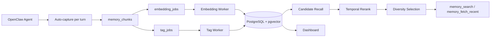

<div align="center">

# Memsense

<p><strong>A memory brain for OpenClaw agents</strong></p>
<p>Biomimetic memory · experience trajectory · self-evolving retrieval · continual-learning ready</p>

<p>
  
  
  
  
</p>

<p>
  
</p>

</div>

---

## What is Memsense?

Memsense is not just a vector database wrapper or a thin memory plugin.

It is a **memory brain** for agents: a system that continuously captures interaction traces, turns them into structured experience, and makes that experience retrievable, filterable, and increasingly useful over time.

The core idea is simple:

- an agent should **remember**
- memory should be shaped by **trajectory and experience**, not only static facts
- retrieval should become **more adaptive over time**, not stay frozen at naive similarity top-k
- the whole stack should be ready for future **continual learning** workflows

If you want your agent to move from “has tools” to “has experience”, Memsense is the memory layer for that.

---

## Why it matters

Most agent memory systems stop at storing chunks and running vector search.
Memsense is designed around a more lifelike model:

- **Memory brain, not memory bucket**  
  Treat memory as an active layer for recall, ranking, filtering, and reuse.

- **Experience trajectory, not isolated snippets**  
  Preserve conversation turns with `session_id`, `agent_id`, `user_id`, and source context so memory comes from actual agent history.

- **Self-evolving retrieval**  
  Retrieval quality improves through richer metadata, temporal semantics, reranking, and diversity-aware selection.

- **Continual-learning ready foundation**  
  Today it powers better memory recall; tomorrow it can support replay, offline tuning, preference adaptation, and longer-horizon learning loops.

---

## Core story

Memsense is built around three product pillars:

### 1. Biomimetic memory brain
A layered memory system with:
- online capture
- async enrichment
- temporal semantics
- retrieval-time selection instead of raw nearest-neighbor dumping

### 2. Experience trajectory and self-evolution
Each interaction becomes part of the agent’s experience trail:
- automatic per-turn QA capture
- tags and `memory_kind` added asynchronously
- session / agent / user identity retained for future filtering and learning

### 3. Continual learning compatibility
Memsense already stores the kind of data foundation continual learning needs:
- structured historical traces
- separable identity dimensions
- replayable chunks
- operational visibility through dashboard and test surfaces

---

## Why Memsense is different

Memsense is built for real agent workloads:

- **Long-term memory that scales** with PostgreSQL + pgvector
- **Better retrieval quality** with candidate recall + temporal rerank + diversity selection
- **Automatic online capture** so useful experience is not lost turn by turn
- **Reliable async enrichment** with embedding jobs, tag jobs, retry, and DLQ
- **Operational visibility** through a session-first dashboard and RBAC
- **OpenClaw-native integration** as a memory slot plugin

---

## What you get today

- OpenClaw plugin id: `memsense`
- Exposed tools:
  - `memory_search`
  - `memory_fetch_recent`
- Automatic per-turn QA capture on the online path
- Async embedding and async tagging after each saved chunk
- `memory_save` retained for internal maintenance / backfill / debug, not the model-facing tool surface
- Dashboard for overview, list, detail, test, raw, and model-facing inspection

---

## Architecture at a glance

- **Plugin gateway** (`index.ts`) for OpenClaw tools and online auto-capture
- **Backend API** (`src/server`) for memory services
- **Storage** (`memory_chunks`, `memory_chunk_embeddings`, `memory_events`)
- **Worker** (`src/worker`) for embedding + async tagging jobs (retry/DLQ)
- **Dashboard** (`/dashboard`) with token-based RBAC



### Identity fields carried in storage

Each QA chunk preserves identity dimensions for isolation, filtering, and future learning workflows:

- `session_id`
- `agent_id`
- `user_id`

This makes it possible to distinguish:
- different sessions of the same agent
- different agents serving the same user
- global vs session-scoped retrieval views
- future replay / analysis / continual-learning pipelines

---

## Quick Start

### 1) One-click bootstrap (recommended)

**Docker available:**

```bash
cp .env.example .env
bash scripts/bootstrap.sh
```

**No Docker environment:**

```bash
cp .env.example .env
bash scripts/bootstrap-nodocker.sh
```

Both commands will ask you to choose embedding strategy:
- `openai` (OpenAI-compatible / Qwen embedding API)
- `local` (local BGE)

Non-interactive:

```bash
bash scripts/bootstrap.sh openai
bash scripts/bootstrap.sh local

bash scripts/bootstrap-nodocker.sh openai
bash scripts/bootstrap-nodocker.sh local
```

For **no-docker mode**, the bootstrap script will automatically normalize `.env` to localhost defaults:
- `MEMSENSE_DATABASE_URL=postgresql://127.0.0.1:5432/memsense`
- `MEMSENSE_BGE_ENDPOINT=http://127.0.0.1:8080/embed`

> Local mode first startup may take longer because the BGE model is downloaded automatically.

### Optional: run as persistent macOS services (launchd)

For no-docker deployments on macOS, you can install persistent user services:

```bash
bash scripts/install-launchd.sh
```

This installs and loads three LaunchAgents:
- `local.memsense.bge`
- `local.memsense.server`
- `local.memsense.worker`

Logs are written to:
- `.runtime/launchd-bge.out.log`
- `.runtime/launchd-bge.err.log`
- `.runtime/launchd-server.out.log`
- `.runtime/launchd-server.err.log`
- `.runtime/launchd-worker.out.log`
- `.runtime/launchd-worker.err.log`

To uninstall them later:

```bash
bash scripts/uninstall-launchd.sh
```

### 2) Install plugin into OpenClaw

```bash
openclaw plugins install -l <path-to-memsense>
openclaw plugins enable memsense
openclaw gateway restart
openclaw plugins list
```

### 3) Bind memory slot

In `~/.openclaw/openclaw.json`:

```json
{
  "plugins": {
    "entries": {
      "memsense": { "enabled": true }
    },
    "slots": {
      "memory": "memsense"
    }
  }
}
```

---

## Embedding Provider Configuration

Memsense supports two modes:

### OpenAI-compatible (recommended for Qwen embedding)

- `MEMSENSE_EMBEDDING_PROVIDER=openai`
- `MEMSENSE_OPENAI_BASE_URL=...`
- `MEMSENSE_OPENAI_API_KEY=...`
- `MEMSENSE_EMBEDDING_MODEL=...`

### Local BGE HTTP

- `MEMSENSE_EMBEDDING_PROVIDER=bge_http`
- `MEMSENSE_BGE_ENDPOINT=http://127.0.0.1:8000/embed`
- `MEMSENSE_BGE_MODEL=bge-large-zh-v1.5`

---

## Enter Dashboard

Dashboard includes a **Tool Playground** panel to test real API calls for:
- `memory_search` (`/v1/memory/search`)
- `memory_fetch_recent` (`/v1/memory/fetch_recent`)

Dashboard list/detail views also show identity metadata including:
- `session_id`
- `agent_id`
- `user_id`

### First-time access (important)

After startup, open:

- `http://127.0.0.1:8787/dashboard`

The dashboard page itself is public so first-time users can reach the token form.
Actual dashboard APIs remain protected by token-based RBAC.

You can provide the token in either way:

1. Paste it into the **Dashboard Access** box in the page and click **保存并加载**
2. Or open with query param:
   - `http://127.0.0.1:8787/dashboard?token=<your_token>`

If you expose a different port/host, replace accordingly.

### Default local token

In `.env.example` the default token map is:

- `MEMSENSE_DASHBOARD_TOKENS_JSON={"demo":"admin"}`

So for local bootstrap, the default first-use token is usually:

- `demo`

### Custom token map

Token is configured by:

- `MEMSENSE_DASHBOARD_TOKENS_JSON={"token_viewer":"viewer","token_ops":"operator","token_admin":"admin"}`

Examples:

- Viewer access: `http://127.0.0.1:8787/dashboard?token=token_viewer`
- Operator access: `http://127.0.0.1:8787/dashboard?token=token_ops`
- Admin access with default example token: `http://127.0.0.1:8787/dashboard?token=demo`

### Troubleshooting

If you open `/dashboard` and see no data:

- check whether token is filled in the page
- verify `MEMSENSE_DASHBOARD_TOKENS_JSON` in `.env`
- make sure the server was restarted after editing `.env`
- if API calls return `unauthorized`, the token is missing or wrong
- if API calls return `forbidden`, the token exists but role is too low for that action

---

## Security & Operations

- Dashboard RBAC via token roles (`viewer` / `operator` / `admin`)
- Worker resilience:
  - queue claim with lock
  - exponential retry
  - DLQ fallback
- Async tag enrichment (user-invisible):
  - tag jobs run in background
  - uses OpenClaw agent command internally for tag generation
  - generates both `tags` and a single `memory_kind` (`stable | preference | episodic | ephemeral`)

---

## Feature Docs

- `docs/features/embedding-search.md`
- `docs/features/dashboard-rbac.md`
- `docs/features/worker-retry-dlq.md`

(Internal deep-dive engineering docs are kept in Obsidian.)

---

## Local Validation

```bash
npm test
npm run db:migrate
```

Recommended validation checklist after schema or capture changes:

1. confirm DB/server/worker are running
2. run `npm run db:migrate`
3. verify `/dashboard` loads
4. verify a fresh QA chunk can be written with:
   - `session_id`
   - `agent_id`
   - `user_id`
5. verify `memory_fetch_recent` can filter by `session_id` and `agent_id`
