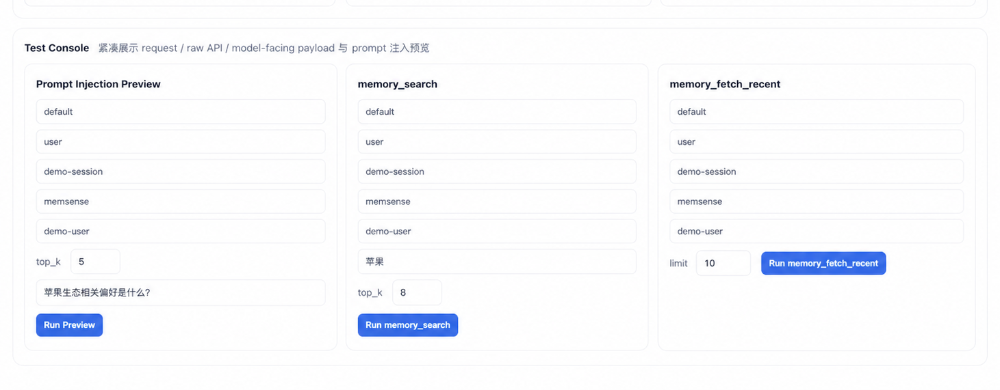

<div align="center">

# Memsense

**Living memory for agents — turn every trajectory into experience.**

<sub>▶ Cached startup in ~60 seconds — [Quick Start](#quick-start)</sub>

<p>
  
  
  
</p>

</div>

<p align="center">
  
</p>

<p align="center">
  
  
  
</p>

---

## Overview

### Why we built Memsense

Inside a single session, your agent gets noticeably smarter. It figures out what *"the prod DB"* really means, learns to avoid the script that broke last time, picks up the way you like reports summarized. Then the session ends — and all of it disappears. Next time, you start over.

Most "memory" plugins try to patch this by dumping every message into a vector store. That isn't memory; it's a haystack. When the agent surfaces the wrong context, you can't tell why. When it forgets what actually mattered, you can't make it remember.

Memsense takes a different approach:

- **Remember what worked, not everything.** Every interaction is captured, classified, and scored by outcome. Memories that helped get re-injected automatically; noisy ones decay.
- **See exactly what the agent sees.** A built-in dashboard renders the live context block being passed to the model, with per-result scores and matched routes. Promote, demote, or forget anything in one click.
- **Run it entirely on your hardware.** Local mode uses a containerized BGE embedding model — zero outbound traffic, verifiable with `tcpdump`. Cloud mode works with any OpenAI-compatible endpoint when you'd rather offload embedding.

### What you get

**A memory that learns from itself.**
Every agent turn becomes a typed memory chunk — `stable`, `preference`, `episodic`, or `ephemeral`. The retrieval engine re-injects the most relevant ones before each LLM call, and successful recalls bump the score so good memories rise on their own. No fine-tuning, no manual curation.

**A test console, not a black box.**
Type any query and see the exact `<relevant_context>` your model is about to receive — live, not a simulation. Each result shows its `rrf_score`, matched routes, and `final_score`, so when recall feels off you can debug it in two clicks instead of guessing.

**Truly self-hosted, no external API required.**
Database, embeddings, workers, and dashboard all run in your environment. Fully-local mode makes zero outbound calls — easy to deploy in air-gapped or regulated environments where agent traces can't leave the network.

**Model-agnostic and predictable.**
The retrieval engine is a hard-coded 8-route RRF + MMR pipeline — no LLM is in the loop deciding what to recall. Behavior stays stable whether you swap between Doubao, Qwen, Claude, GPT, Kimi, or whatever lands next quarter.

---

## Quick Start

### 1. Choose an embedding mode

| Mode | Best for | Requires |
|---|---|---|
| `local` | self-hosted, no external embedding API | Docker recommended; BGE model downloads on first run (~1 GB) |
| `openai` | fastest startup | `MEMSENSE_OPENAI_API_KEY` in `.env` |

### 2. Start Memsense

```bash
cp .env.example .env
bash scripts/bootstrap.sh local    # fully local — zero outbound traffic
# or:
bash scripts/bootstrap.sh openai   # cloud embedding (set MEMSENSE_OPENAI_API_KEY in .env first)
```

Check services: `docker compose ps`

> **First run** downloads the BGE model and builds service images (~a few minutes). Subsequent startups are fast.

<details>
<summary>No Docker? (macOS / Linux alternative)</summary>

```bash
cp .env.example .env
bash scripts/bootstrap-nodocker.sh local   # or: ...nodocker.sh openai
bash scripts/start-bash.sh
```

On macOS, Homebrew installs PostgreSQL + pgvector automatically. On Linux, install Node.js 20+, PostgreSQL 16+, pgvector, Python 3, and venv support first.

`bootstrap-nodocker.sh` installs deps + initializes the database; `start-bash.sh` starts server, embedding worker, tag worker, and the Python BGE service.

</details>

<details>
<summary>Port conflict? (custom host port)</summary>

```bash
MEMSENSE_HOST_PORT=18787 bash scripts/bootstrap.sh local
```

Update all subsequent URLs accordingly (e.g. `http://127.0.0.1:18787/dashboard`).

</details>

### 3. Install into OpenClaw

```bash
openclaw plugins install -l <path-to-memsense>
openclaw plugins enable memsense
openclaw gateway restart
```

> `-l` does a linked install from a local path, useful while iterating on the plugin.

### 4. Bind the memory slot

```json
{
  "plugins": {
    "entries": { "memsense": { "enabled": true } },
    "slots":   { "memory": "memsense" }
  }
}
```

### 5. Open the dashboard

```
http://127.0.0.1:8787/dashboard?token=demo
```

> `demo` is the default development token. Change `MEMSENSE_DASHBOARD_TOKENS_JSON` before exposing the service beyond localhost.

### 6. Smoke test

```bash
MEMSENSE_SMOKE_BASE_URL=http://127.0.0.1:8787 \
MEMSENSE_SMOKE_TOKEN=demo \
npm run smoke:api
```

> A successful run prints capture / search / fetch checks ending with all green PASS lines and exit code 0.

---

## Evaluation

Tested on [LoCoMo](https://github.com/snap-stanford/locomo) long-range dialogue benchmark (1,540 cases), model `doubao-seed-2.0-pro-260215`. Evaluation script: [`evaluation/`](evaluation/).

> [!IMPORTANT]
> **73.77% task completion on LoCoMo** — +21.7pp over OpenViking, +38.1pp over OpenClaw memory-core.

| Configuration | Task Completion | Input Tokens | Completion / 1M tokens |
|---|:---:|---:|:---:|
| OpenClaw (memory-core) | 35.65% | 24,611,530 | 1.45 |
| OpenClaw + LanceDB (−memory-core) | 44.55% | 51,574,530 | 0.86 |
| OpenClaw + OpenViking Plugin (−memory-core) | 52.08% |  4,264,396 | 12.21 |
| OpenClaw + OpenViking Plugin (+memory-core) | 51.23% |  2,099,622 | 24.40 |
| **OpenClaw + Memsense** | **73.77%** | **3,506,310** | **21.04** |

Conclusions:

- Compared to OpenClaw memory-core: **+38.1pp task completion** at **1/7th the input-token cost**.
- Compared to OpenViking (−memory-core): **+21.7pp task completion** with fewer tokens.
- Memsense spends ~1.4M more tokens than OpenViking+memory-core for a **+22.5pp gain** — quality-over-efficiency trade-off.

---

## How It Works

### Brain-like memory

Memsense observes every agent turn, captures useful trajectories as structured memory chunks, and re-injects the most relevant ones before each LLM call. The loop is automatic:

1. **Capture** — every agent turn is captured automatically by the OpenClaw memory hook (no manual API call); it's normalized into a canonical QA chunk, deduped within a 10-minute window, and written to `memory_chunks`.
2. **Enrich** — async embedding worker computes full QA, user-perspective, assistant-perspective, next-user, and facet vectors; async tag worker extracts tags, memory kind, and summary via an optional tagger LLM.
3. **Retrieve** — 8 parallel search routes (4 vector · 1 lexical · 3 facet) → Reciprocal Rank Fusion → MMR diversity selection → top-k chunks.
4. **Inject** — `<relevant_context>` block inserted before the LLM call.

<details>
<summary><b>Showcase — from agent error to automatic experience</b></summary>

A data-ops agent is asked to `parse report_q1.csv` on **day 1**:

```diff
  USER    parse report_q1.csv and summarise revenue by client.
  AGENT   reads file → naive split(",") → breaks on quoted commas.
- USER    ✗ numbers are off — "Client, Inc" got split into two columns.
+ AGENT   switches to csv-parse library → re-runs → correct result.
```

Memsense distils that trajectory into a memory. On **day 12**, a different task arrives — `clean up customers_export.csv` — and the prompt hook injects:

```xml
<relevant_context source="memsense" matched_routes="vec_user,lex,facet_ev">
  <memory kind="episodic" score="0.70" rrf="0.31">
    <task_tag>CSV with quoted commas — don't use naive split; use csv-parse</task_tag>
  </memory>
</relevant_context>
```

The agent uses `csv-parse` from the first attempt. No rework. The memory's score climbs with each reuse; a human `promote` in the dashboard pins it to the top.

```
day 1   USER corrects agent          → memory captured     memory_score 0.50
day 12  recalled → reused → success  → auto-bumped         memory_score 0.65
day 18  recalled again → success     → auto-bumped         memory_score 0.78
day 23  human clicks promote         → pinned, top-ranked  memory_score 0.93
```

</details>

### Visual Dashboard

<p align="center">
  
</p>

- **Prompt Injection Preview** — type a query and see the exact `<relevant_context>` the model will receive. Not a simulation — the live system output.
- **memory_search** — fire a semantic search and inspect each result's `rrf_score`, matched routes, and `final_score`.
- **memory_fetch_recent** — pull the latest captured chunks to verify what was just remembered.

### Architecture

[View system flowchart](docs/assets/system-flowchart.png) (details in [`docs/features/retrieval-algorithm.md`](docs/features/retrieval-algorithm.md)). Full details in [`docs/features/architecture-overview.md`](docs/features/architecture-overview.md) and [`docs/features/retrieval-algorithm.md`](docs/features/retrieval-algorithm.md).

| Layer | What it does |
|---|---|
| Capture | Normalizes agent history into QA chunks; 10-minute dedup window. |
| Enrichment | Async workers compute full/user/assistant/next-user/facet embeddings + tags + memory kind + facets. |
| Retrieval | 8-route search (4 vector · 1 lexical · 3 facet) → RRF rank fusion. |
| Selection | Default chunk-level RRF + MMR diversity (λ=0.78); session-first hybrid scoring activates only for evaluation data ingested with `--mode hybrid`. |

---

## Configuration

All settings live in `.env`. See [`.env.example`](.env.example) for the full reference. The shipped `.env.example` already works for local mode out of the box; you only need to edit it when switching to OpenAI-compatible embedding or exposing the dashboard beyond localhost.

Minimum local mode settings: `MEMSENSE_DATABASE_URL` · `MEMSENSE_EMBEDDING_PROVIDER=bge_http` · `MEMSENSE_BGE_ENDPOINT` · `MEMSENSE_DASHBOARD_TOKENS_JSON`.

Minimum cloud embedding settings: `MEMSENSE_DATABASE_URL` · `MEMSENSE_EMBEDDING_PROVIDER=openai` · `MEMSENSE_OPENAI_BASE_URL` · `MEMSENSE_OPENAI_API_KEY` · `MEMSENSE_EMBEDDING_MODEL` · `MEMSENSE_DASHBOARD_TOKENS_JSON`.

Optional tag generation: set `MEMSENSE_TAGGER_BASE_URL`, `MEMSENSE_TAGGER_API_KEY`, and `MEMSENSE_TAGGER_MODEL`. If unset, capture and retrieval still work; tags and facets stay empty.

---

## Roadmap — from memory to continual learning

[View diagram](docs/assets/roadmap.png)

Memsense captures every trajectory with structured metadata (kind, tags, facets, outcome score, events) — the foundation for the next step: **refined trajectories flowing back into model training** (Capture → Refine Signal → Learn Model).

Everything *above* this section runs today; this section is the north star.

---

## Docs

- [Architecture overview](docs/features/architecture-overview.md)
- [Retrieval algorithm — RRF + MMR](docs/features/retrieval-algorithm.md)
- [Dashboard & RBAC](docs/features/dashboard-rbac.md)
- [Worker retry / DLQ](docs/features/worker-retry-dlq.md)
- [Local BGE one-click setup](docs/features/local-bge-oneclick.md)
- [API smoke test](docs/features/api-smoke-test.md)
- [No-Docker quickstart](docs/features/no-docker-quickstart.md)

---

## License

[MIT](LICENSE).
