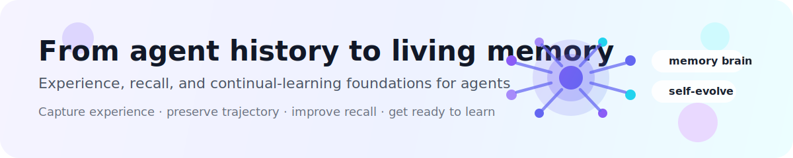
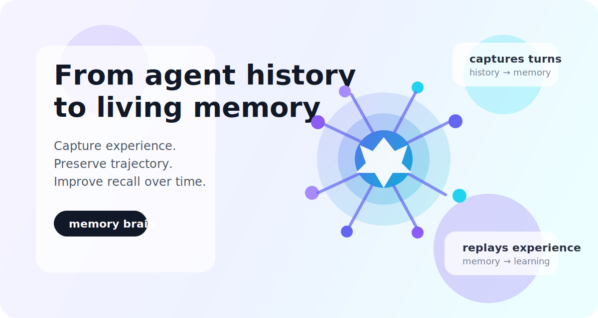
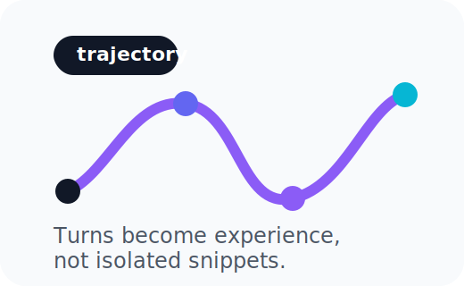
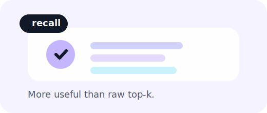
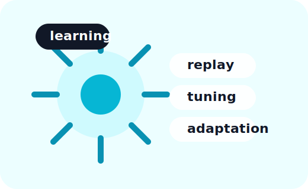

<div align="center">

# Memsense

<p><strong>From agent history to living memory</strong></p>
<p>Experience, recall, and continual-learning foundations for agents</p>

<p align="center">
  
</p>

<p>
  
  
  
  
</p>

<p>
  
</p>

</div>

<p align="center">
  
</p>

<p align="center">
  
  
  
</p>

---

## Why Memsense

**Memsense turns agent history into living memory.**

It captures experience turn by turn, preserves trajectory across sessions and agents, and makes recall better over time.

Not just stored chat logs.  
Not just vector search.  
Not just another plugin.

---

## Why people try it

- **Memory brain** — recall, rank, filter, reuse
- **Experience trajectory** — memory built from real interaction history
- **Self-evolving recall** — retrieval improves with richer memory structure
- **Continual-learning foundation** — ready for replay, tuning, and adaptation

---

## Use cases

- **Personal AI memory**
- **Long-term memory for one agent**
- **Shared memory for multi-agent systems**
- **Replay data for future learning loops**

---

## Quick Start

### 1. Start Memsense

```bash
cp .env.example .env
bash scripts/bootstrap.sh
```

No Docker?

```bash
cp .env.example .env
bash scripts/bootstrap-nodocker.sh
```

### 2. Install into OpenClaw

```bash
openclaw plugins install -l <path-to-memsense>
openclaw plugins enable memsense
openclaw gateway restart
```

### 3. Bind the memory slot

```json
{
  "plugins": {
    "entries": {
      "memsense": { "enabled": true }
    },
    "slots": {
      "memory": "memsense"
    }
  }
}
```

### 4. Open the dashboard

```text
http://127.0.0.1:8787/dashboard?token=demo
```

---

## Learn more

- Docs hub: [`docs/README.md`](docs/README.md)
- Retrieval logic: [`docs/features/embedding-search.md`](docs/features/embedding-search.md)
- Dashboard / RBAC: [`docs/features/dashboard-rbac.md`](docs/features/dashboard-rbac.md)
- Worker reliability: [`docs/features/worker-retry-dlq.md`](docs/features/worker-retry-dlq.md)

---

