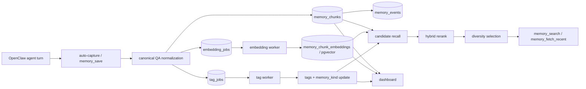
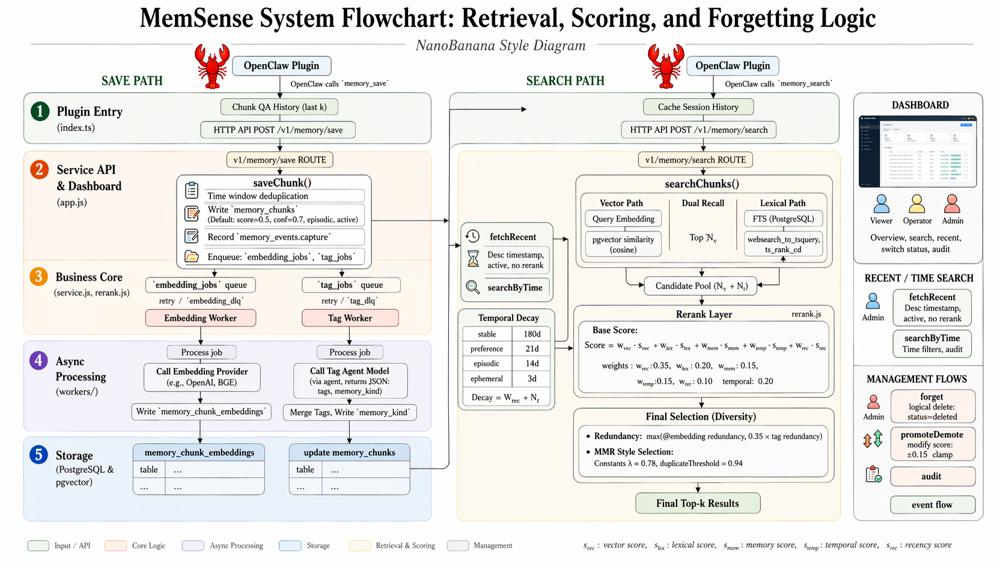

# Architecture Overview

> Docs → [Memsense Docs](../README.md)  
> See also: [Retrieval Algorithm](retrieval-algorithm.md) · [Embedding & Search](embedding-search.md) · [Worker / Retry / DLQ](worker-retry-dlq.md)

## What this page is for

This page explains the full Memsense system flow:
- how agent history becomes memory
- how the write path stays fast
- how retrieval is structured
- where dashboard and operational surfaces fit

---

## At a glance

Memsense has four layers:

1. **capture** — turn online interaction into memory chunks
2. **enrichment** — add embeddings, tags, and memory-type semantics
3. **retrieval** — recall candidate memories from storage
4. **selection** — rerank and diversify results before returning them

---

## System flow

---

## Design reference — retrieval, scoring, and forgetting

The diagram below is the **full design reference** covering the save path, search path, scoring model, temporal decay, and management flows (forget / promote-demote / audit).

> **Note.** This diagram represents the target design. The current runtime implements the save / search topology, 8-route recall, MMR selection (λ = 0.78, duplicate threshold = 0.94), promote / demote ±0.15, and soft-delete forget as shown. The weighted base-score composition (`W_vec · vec + W_lex · lex + W_mem · mem + W_conf · conf + W_temp · temp`) and the per-kind temporal-decay windows (stable 180d / preference 21d / episodic 14d / ephemeral 3d) are the planned scoring model; the current code uses RRF rank fusion with `final_score = rrf_score + 0.1 · memory_score` and has `confidence` / `temporal_score` removed from the live scoring path (see `src/server/retrieval/rerank.js:49-52`). Treat the diagram as roadmap + mental model, not as a line-by-line runtime spec.

---

## Layer 1 — Capture

Capture is the point where agent history becomes memory.

Current write path:
- online QA turns are captured automatically
- `memory_save` is retained for internal maintenance / backfill / debug
- content is normalized into canonical QA format before storage
- obvious near-duplicate inserts are rejected within a short time window

Stored chunk identity includes:
- `tenant_id`
- `scope`
- `session_id`
- `agent_id`
- `user_id`
- `source`

This is what makes Memsense more than a text bucket: memory is tied to real interaction trajectory.

---

## Layer 2 — Enrichment

Enrichment happens asynchronously so the write path stays fast.

### Embedding worker
- reads pending `embedding_jobs`
- computes embeddings
- stores vectors into `memory_chunk_embeddings`

### Tag worker
- reads pending `tag_jobs`
- generates `tags`
- assigns `memory_kind`
- updates the original chunk row

Current `memory_kind` values:
- `stable`
- `preference`
- `episodic`
- `ephemeral`

This layer gives retrieval more structure than raw text similarity alone.

---

## Layer 3 — Retrieval

When a query arrives, Memsense does not rely on a single route.

Current retrieval path uses 8-route recall:
- **vector recall** from full QA, user-side, assistant-side, next-user, and facet embeddings
- **lexical recall** from PostgreSQL full-text search

The route ranks are fused with RRF before MMR selection.

Why this matters:
- vector recall improves semantic coverage
- lexical recall helps exact terms, entities, and phrasing
- route fusion is more robust than any single route alone

---

## Layer 4 — Selection

After candidate recall, Memsense applies retrieval-time selection rather than returning raw similarity top-k.

Selection currently includes:
- RRF rank fusion
- memory-score prior
- session-first hybrid selection for evaluation data (`eval_ingest_session` remains prompt-visible; `eval_ingest_turn` only boosts the matching session)
- redundancy-aware final selection

This is the core of the “living memory” idea:
retrieval should reflect not only similarity, but also reuse value and diversity.

---

## Operational surfaces

### Dashboard
The dashboard is the operational window into the memory system:
- overview
- list / detail
- inspect memory metadata
- status operations
- test and debug flows

### Events and queues
Memsense also records operational traces:
- `memory_events`
- embedding job state
- tag job state
- retry / DLQ outcomes

These surfaces make the system observable and debuggable in production.

---

## Mental model

The simplest way to understand Memsense is:

- **history** is captured as chunks
- **experience** is enriched with semantics
- **memory** is retrieved through ranking and selection
- **learning** becomes possible because the stored traces are structured and replayable

That is the architectural meaning of:

**From agent history to living memory.**

---

## Next pages

- Read [Retrieval Algorithm](retrieval-algorithm.md) for the scoring and selection logic.
- Read [Worker / Retry / DLQ](worker-retry-dlq.md) for async job lifecycle and reliability.
- Read [Dashboard & RBAC](dashboard-rbac.md) for operational surfaces.
