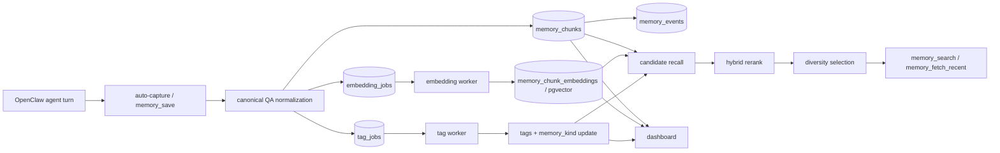

# Architecture Overview

Memsense is a memory system that turns online agent interaction history into retrievable, structured memory.

At a high level, the system has four layers:

1. **capture** — turn online interaction into memory chunks
2. **enrichment** — add embeddings, tags, and memory-type semantics
3. **retrieval** — recall candidate memories from storage
4. **selection** — rerank and diversify results before returning them

---

## System flow

---

## Layer 1: capture

Capture is the point where agent history becomes memory.

Current write path:
- online QA turns are captured automatically
- `memory_save` is retained for internal maintenance / backfill / debug
- content is normalized into canonical QA format before storage
- obvious near-duplicate inserts are rejected within a short time window

Stored chunk identity includes:
- `tenant_id`
- `scope`
- `session_id`
- `agent_id`
- `user_id`
- `source`

This is what makes Memsense more than a text bucket: memory is tied to real interaction trajectory.

---

## Layer 2: enrichment

Enrichment happens asynchronously so the write path stays fast.

### Embedding worker
- reads pending `embedding_jobs`
- computes embeddings
- stores vectors into `memory_chunk_embeddings`

### Tag worker
- reads pending `tag_jobs`
- generates `tags`
- assigns `memory_kind`
- updates the original chunk row

Current `memory_kind` values:
- `stable`
- `preference`
- `episodic`
- `ephemeral`

This layer gives retrieval more structure than raw text similarity alone.

---

## Layer 3: retrieval

When a query arrives, Memsense does not rely on a single route.

Current retrieval path uses dual recall:
- **vector recall** from embeddings
- **lexical recall** from PostgreSQL full-text search

The candidate sets are merged before reranking.

This matters because:
- vector recall improves semantic coverage
- lexical recall helps exact terms, entities, and phrasing
- union recall is more robust than either route alone

---

## Layer 4: selection

After candidate recall, Memsense applies retrieval-time selection rather than returning raw similarity top-k.

Selection currently includes:
- hybrid score computation
- temporal scoring using `memory_kind`
- redundancy-aware final selection

This is the core of the “living memory” idea:
retrieval should reflect not only similarity, but also time, stability, confidence, and diversity.

---

## Operational surfaces

### Dashboard
The dashboard is the operational window into the memory system:
- overview
- list / detail
- inspect memory metadata
- status operations
- test and debug flows

### Events and queues
Memsense also records operational traces:
- `memory_events`
- embedding job state
- tag job state
- retry / DLQ outcomes

These surfaces make the system observable and debuggable in production.

---

## Mental model

The simplest way to understand Memsense is:

- **history** is captured as chunks
- **experience** is enriched with semantics
- **memory** is retrieved through ranking and selection
- **learning** becomes possible because the stored traces are structured and replayable

That is the architectural meaning of:

**From agent history to living memory.**
