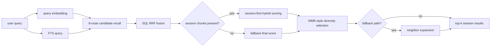

# Retrieval Algorithm

> Docs → [Memsense Docs](../README.md)  
> See also: [Architecture Overview](architecture-overview.md) · [Embedding & Search](embedding-search.md)

## What this page is for

This page explains how Memsense ranks and selects memories today.

The goal is not “nearest chunk wins”. The goal is:
- relevant memory
- current-enough memory
- lower redundancy
- better final top-k

---

## Retrieval pipeline



---

## Step 1 — 8-route recall

Memsense recalls candidates from eight parallel routes:

- `vec_full`: full QA chunk embedding
- `vec_user`: user-side embedding
- `vec_asst`: assistant-side embedding
- `vec_next_user`: next user turn embedding, backfilled onto the previous chunk
- `lexical`: PostgreSQL full-text search over `task_tag + content`
- `facet_personal_info`: personal-info facet embedding
- `facet_preferences`: preference facet embedding
- `facet_events`: event facet embedding

Candidate pool sizing:
- per-route candidates: `max(max(top_k * 4, 32) * 2, 40)`
- final candidate limit before MMR: `max(top_k * 4, 32)`

This creates a broader candidate pool before reranking.

---

## Step 2 — RRF fusion

SQL fuses all route ranks using Reciprocal Rank Fusion:

```text
rrf_score = sum(1 / (15 + rank_in_route))
```

RRF uses route rank rather than raw similarity, so vector, lexical, and facet routes can be combined without fragile score normalization.

---

## Step 3 — Final score

The current final score is:

```text
final_score = rrf_score + 0.1 * memory_score
```

`memory_score` is the stored chunk quality score. `confidence` and temporal decay are not in the live scoring path.

For evaluation data ingested with `--mode hybrid`, session chunks remain the prompt-visible memory. Turn chunks do not directly enter the final top-k; they add bounded support to the matching session:

```text
turn_support = min(0.12, 0.6 * best_turn_rrf_score_for_same_session)
hybrid_rrf_score = session_rrf_score + turn_support
```

If no session chunk is available, retrieval falls back to the normal chunk-level ranking path.

---

## Step 4 — Redundancy-aware selection

Memsense does not stop at base ranking.

It then applies diversity-aware final selection using an MMR-style procedure.

### Redundancy signal
Redundancy between two candidates is estimated from:
- embedding cosine similarity
- tag overlap (Jaccard similarity)

Current combined redundancy score:

```text
redundancy = max(embedding_similarity, 0.35 * tag_jaccard)
```

### Final selection objective
For each remaining candidate:

```text
mmr_score = lambda * final_score - (1 - lambda) * max_redundancy
```

Current defaults:
- `lambda = 0.78`
- `duplicate_threshold = 0.94`

This helps prevent the final results from collapsing into many near-identical chunks.

---

## Why this matters

A naive memory system often fails in three ways:

1. **too literal** — misses semantically related memory
2. **too repetitive** — returns many near-duplicate chunks
3. **too stale** — returns memory that is similar but no longer timely

The current Memsense pipeline directly addresses those problems:
- multi-route recall for better coverage
- memory score for reusable high-value chunks
- diversity selection for lower redundancy

---

## Current implementation shape

In today’s code, the retrieval logic is split roughly into:
- candidate recall in `src/server/service.js`
- rerank and diversity logic in `src/server/retrieval/rerank.js`
- utility scoring logic in `src/core/scoring.js`

This separation makes it easier to evolve retrieval quality without rewriting the entire write path.

---

## Output fields

Current search results expose ranking detail through fields such as:
- `rrf_score`
- `routes`
- `final_score`
- `explain`

For session-first hybrid results, `explain` also includes `session_rrf_score`, `turn_support`, `supporting_turn_count`, and `best_turn_routes`.

This makes retrieval behavior inspectable and easier to debug.

---

## Summary

Memsense retrieval is built around one idea:

**relevance alone is not enough.**

A useful memory system should return results that are:
- relevant
- timely
- confident
- low-redundancy
- shaped by the type of memory being retrieved

---

## Next pages

- Read [Architecture Overview](architecture-overview.md) for the full system flow.
- Read [Embedding & Search](embedding-search.md) for a compact implementation summary.
