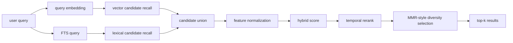

# Retrieval Algorithm

> Docs → [Memsense Docs](../README.md)  
> See also: [Architecture Overview](architecture-overview.md) · [Embedding & Search](embedding-search.md)

## What this page is for

This page explains how Memsense ranks and selects memories today.

The goal is not “nearest chunk wins”. The goal is:
- relevant memory
- current-enough memory
- lower redundancy
- better final top-k

---

## Retrieval pipeline



---

## Step 1 — Dual recall

Memsense recalls candidates from two routes.

### Vector route
- embed the query
- compare against stored embeddings
- compute `vector_score`

### Lexical route
- build PostgreSQL full-text search query
- rank matches with `ts_rank_cd`
- normalize into `lexical_score`

Candidate pool sizing:
- vector candidates: `max(top_k * 4, 16)`
- lexical candidates: `max(top_k * 4, 16)`

This creates a broader candidate pool before reranking.

---

## Step 2 — Feature computation

Each candidate is normalized into a feature set.

Current features:
- `vector_score`
- `lexical_score`
- `score` (stored memory score)
- `confidence`
- `temporal_score`
- `memory_kind`

### Temporal score
Temporal score is not uniform across all memory types.

Current decay windows:
- `stable` → 180 days
- `preference` → 21 days
- `episodic` → 14 days
- `ephemeral` → 3 days

Temporal score is computed as exponential decay:

```text
temporal_score = exp(- age / tau(memory_kind))
```

This means:
- stable facts decay slowly
- ephemeral instructions decay quickly
- preferences and episodes sit in between

---

## Step 3 — Hybrid score

Current base score weights are:

```text
final_score =
  0.35 * vector_score +
  0.20 * lexical_score +
  0.15 * memory_score +
  0.10 * confidence +
  0.20 * temporal_score
```

Where:
- `memory_score` is the stored chunk score
- `confidence` is the stored confidence signal

This score is used to produce the first ranked order.

---

## Step 4 — Redundancy-aware selection

Memsense does not stop at base ranking.

It then applies diversity-aware final selection using an MMR-style procedure.

### Redundancy signal
Redundancy between two candidates is estimated from:
- embedding cosine similarity
- tag overlap (Jaccard similarity)

Current combined redundancy score:

```text
redundancy = max(embedding_similarity, 0.35 * tag_jaccard)
```

### Final selection objective
For each remaining candidate:

```text
mmr_score = lambda * final_score - (1 - lambda) * max_redundancy
```

Current defaults:
- `lambda = 0.78`
- `duplicate_threshold = 0.94`

This helps prevent the final results from collapsing into many near-identical chunks.

---

## Why this matters

A naive memory system often fails in three ways:

1. **too literal** — misses semantically related memory
2. **too repetitive** — returns many near-duplicate chunks
3. **too stale** — returns memory that is similar but no longer timely

The current Memsense pipeline directly addresses those problems:
- dual recall for better coverage
- temporal rerank for current validity
- diversity selection for lower redundancy

---

## Current implementation shape

In today’s code, the retrieval logic is split roughly into:
- candidate recall in `src/server/service.js`
- rerank and diversity logic in `src/server/retrieval/rerank.js`
- utility scoring logic in `src/core/scoring.js`

This separation makes it easier to evolve retrieval quality without rewriting the entire write path.

---

## Output fields

Current search results expose ranking detail through fields such as:
- `vector_score`
- `lexical_score`
- `final_score`
- `explain`

This makes retrieval behavior inspectable and easier to debug.

---

## Summary

Memsense retrieval is built around one idea:

**relevance alone is not enough.**

A useful memory system should return results that are:
- relevant
- timely
- confident
- low-redundancy
- shaped by the type of memory being retrieved

---

## Next pages

- Read [Architecture Overview](architecture-overview.md) for the full system flow.
- Read [Embedding & Search](embedding-search.md) for a compact implementation summary.
